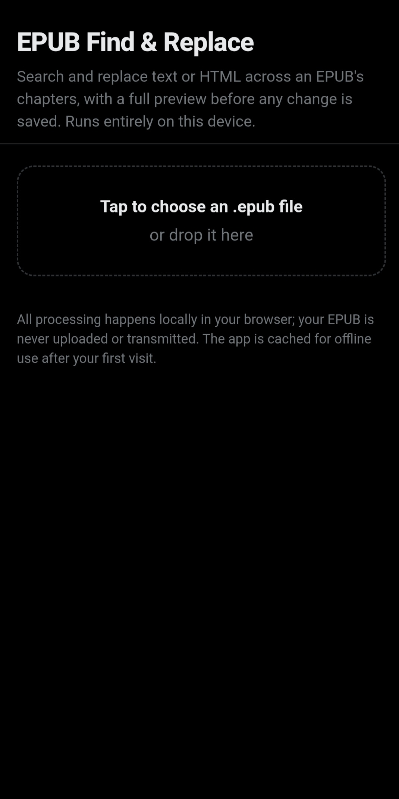
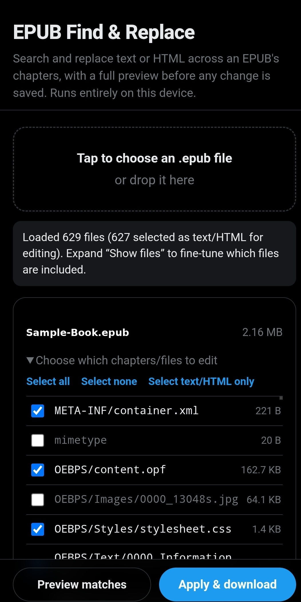
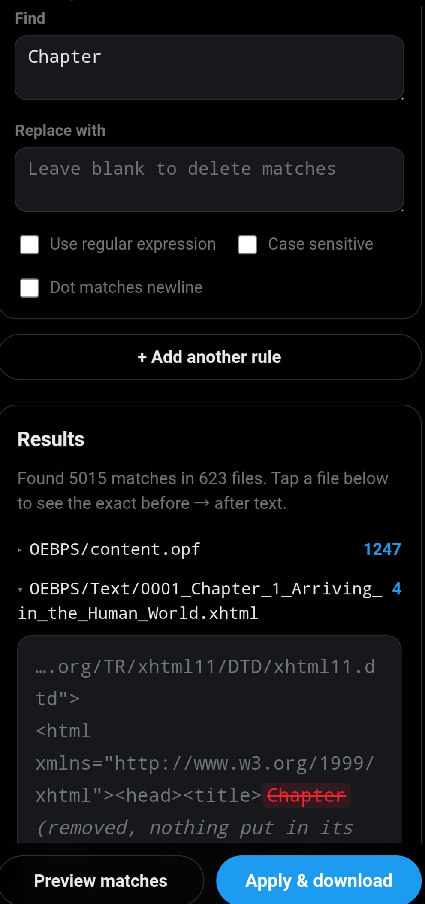
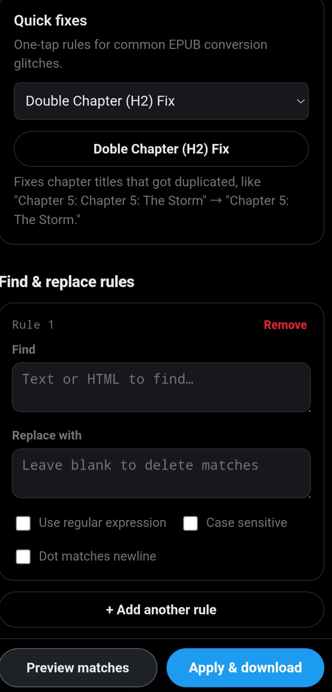

# Mobile EPUB Editor

A simple on-device tool for cleaning up EPUB files — search and replace text or HTML across every chapter, with a full preview before anything is saved. Built as a Progressive Web App and packaged as an installable Android app.

**[⬇ Download the latest APK](../../releases/latest)**

## Features
- Find & replace text or regex patterns across selected chapters
- One-tap quick fixes for common EPUB conversion glitches
- Full preview of every change before saving
- 100% on-device — your EPUB is never uploaded anywhere
- Works offline after first launch

## Screenshots

| Homepage | Chapter Selection |
|---|---|
| 

 | 

 |
| Drop in an EPUB — everything runs locally, nothing is uploaded. | Pick exactly which chapters or files get edited before running a rule. |

| Find, Replace & Preview | Quick Fixes |
|---|---|
| 

 | 

 |
| See every match highlighted with a before → after diff, file by file. | One-tap presets for common conversion glitches, like duplicated chapter titles. |

## Try it in a browser
[daodev96.github.io/Mobile-Epub-Editor](https://daodev96.github.io/Mobile-Epub-Editor/)

## Installing the Android app
1. Download the `.apk` from the [latest release](../../releases/latest)
2. Open it on your Android device
3. Allow "Install unknown apps" if prompted
4. Install and open — it runs like any other app, including offline

## About this project
Runs entirely client-side — no server, no account, no data leaves your device.
